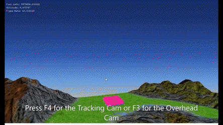
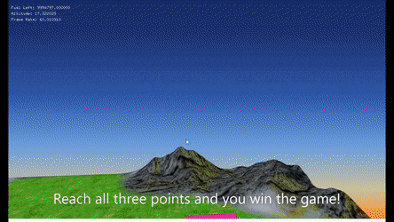

# Balloon Ride

## Developers

- Kenny Lazaro
- Kevin Nguyen

## Description

- Balloon Ride is a game where the player controls a hot air balloon and is required to traverse through mountainous terrain and reach a total of three goal pads in order to achieve victory in the game.
- Gravity will be present in this game, players will have to manage a limited amount of gas in order to stay afloat. Touch terrain for too long and the player will lose!
- Players are able to experiment with the multiple camera angles if the player has trouble landing on a pad due to the nature of three-dimensions and its multiple axises to consider.

## File Info

- [**ofApp.cpp**](https://github.com/k-lazaro/Balloon-Ride/blob/master/ofApp.cpp) is responsible for :
  - Different angles of the camera
  - Loading the particle emitters for the gas and collision animatioms
  - Loading the terrain and air balloon model
  - Loading the octrees and KD trees that are required for hitbox collision with the balloon and terrain
  - Determining the amount of gas the player would have
  - Action listeners for each of the key pressed (Switching camera angles, movement, etc.)
  - Title and UI
- [**KdTree.cpp**](https://github.com/k-lazaro/Balloon-Ride/blob/master/KdTree.cpp) is responsible for :
  - Creating the KD Trees by creating a Box
  - Subdividing the boxes until they are small enough for it to run (smaller boxes achieve more precise collision)
- [**ParticleSystem.cpp**](https://github.com/k-lazaro/Balloon-Ride/blob/master/ParticleSystem.cpp) is responsible for :
  - Producing the different ways particles may be emitted (radial, thurster, etc.) 
  - Setting the different variables the emitters could have (life span, rate, etc.)

## Build Instructions
1. Install Visual Studio 2019 Community on [Windows](https://visualstudio.microsoft.com/downloads/)
2. Download the [OpenFrameworks Tool Kit](https://openframeworks.cc/download/) for Visual Studio 2017 (Will still work with the 2019 edition we installed)
3. Clone repository to a directory
4. By downloading the OpenFrameworks Tool Kit, there should be a project generator. Run that and make sure to include "ofxAssimpModelLoader" and "ofxGUI" as add-ons
5. Locate the directory where the project was located
6. Drag all the .cpp, .cc, and .h files into the src folder and move the data folder in the directory with the src folder
7. Run the application on Visual Studio 2019
8. Play! 

 

   
  <h2>Different Camera Angles</h2>
  
   
   
  <h2>Arriving at a pad</h2>
  
   
   
  <h2>Winning the game</h2>
  
   
   
  <h2>Collision</h2>
  

